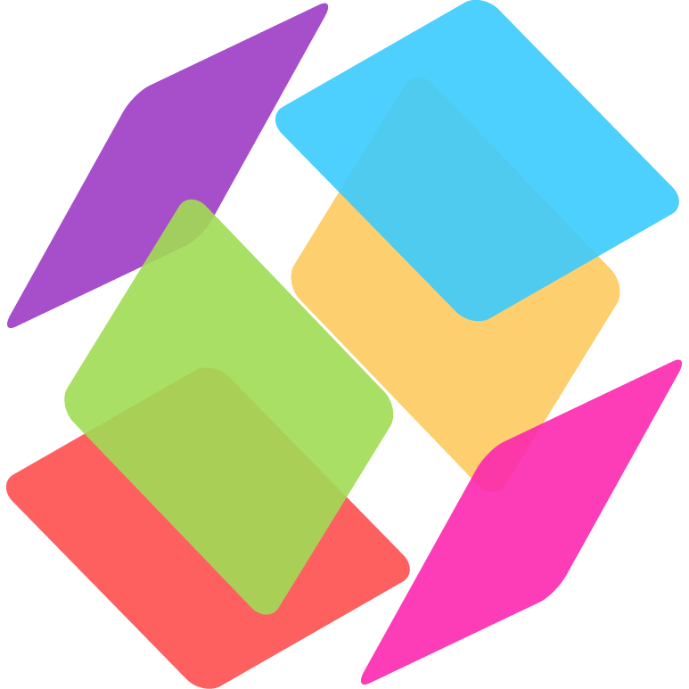
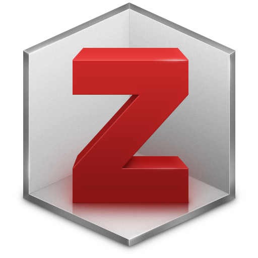

## Comparing reference managers

|  |  |  |  |  |
| :----: | :-----: | :------: | :------: | :----: |
| BibTeX | EndNote | Mendeley | ReadCube | Zotero |
| free license | owned by Clarivate Analytics | owned by Elsevier | owned by Digital Science & Research Solutions, Inc. | free license |
| free of charge | $249.95* | free of charge | $55/year** | free of charge |
|  |  |  |  |  |
| integrated with   LaTeX | integrated with Word OpenOffice (LaTeX) | integrated with Word OpenOffice (LaTeX) | integrated with Word OpenOffice (LaTeX) | integrated with Word OpenOffice LaTeX |
| 9'000+ citation styles | 6,000+ citation styles | 9'000+ citation styles | 9'000+ citation styles | 9'000+ citation styles |

\* student discount: CHF 109.- (in Switzerland)   
\** student discount: 30%

## Why a reference manager?

Zotero is a reference manager. When you use a reference manager, the following tasks are (more or less) a 1-click process:   

* add/import references
* create a bibliography
* cite while you write a paper

All these technical tasks should be done by the software, but remember that **you are the brain**. This means that you should:   

* check if the reference data are correct and complete
* read papers
* sort references
* select relevant references to add in the bibliography

It is important to understand that this kind of software is made to manage a bibliography, not several items of a same document. It's not suitable to keep track of who borrowed what document (e.g. in the lab collection).

## Why Zotero?

Zotero is **user-friendly** and **powerful**. Most ot the recent reference managers chose a similar interface or workflow.   
Zotero is **compatible with a large number of online resources**: as of January 2018, more than 500 fully compatible resources (more than any other reference manager).   
It's **free**. Not only free of charge, but above all it's a free and open source software (no restriction due to the license agreement). This means that when you will leave EPFL, you will still be able to use it like you did here.   
Zotero has also a **large and active community** of users. If you need help, you can quickly get an answer to the issues you face. If you need a feature, its implementation doesn't depend on the developers' willing to do it: you can ask for it (maybe another user already implemented it) or do it by yourself.   
Zotero is **modular**: additional features can be added and shared through plugins ([https://www.zotero.org/support/plugins](https://www.zotero.org/support/plugins)).   

Finally, and even if it's not covered in this workshop, it's important to know that Zotero is made for collaborative work, more than any other reference manager. This includes unlimited members and unlimited items for an unlimited number of group libraries. There are storage space limitations, though.
