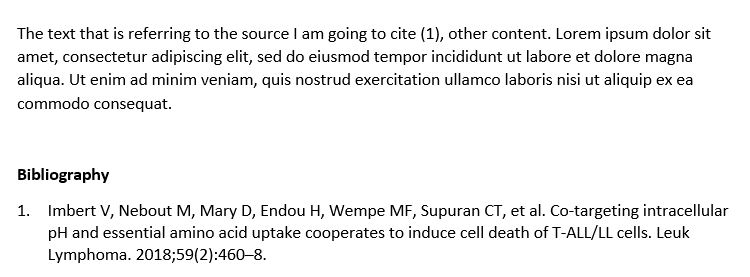

## Citation styles

In this part, you will learn of to change citation styles and how to add new ones.   
Citation styles change how citations appears in your texts and the way metadata is displayed when you create a bibliography. 

>>>>>>> 8d7c3fc6aa1eefb6e27ef3c568dafc2b966f0ee8
A citation style applies rules about which metadata to display for each document type as well as how to format the in-text citation and the reference. These citation styles can be defined by publishers, scientific societies or individuals, for instance. Theoretically, you could apply the citation rules manually, but Zotero will be faster and more consistent.   

It is possible to modify or create one own's citation style, but this topic will be covered in another module. 

## Changing your style... from Zotero

More than 8,900 styles are available for Zotero!   
If you want to apply a citation style to bibliographies you directly create from your Zotero library, you need to select the citation style in Zotero.

1. Open Zotero
2. Go to *Edit > Preferences*
3. Click on the *Cite* tab
4. In the newly opened *Styles* tab, choose the style you want to apply to your bibliography
5. Click on "OK"

## Changing your style... in a document

If you want to change the citation style in a document, you need to make the changes in the word processor / Zotero add-in. 

1. Open the document in the word processor
2. Go on the "Zotero" tab
3. Click on "Document Preferences" button
4. Choose the style you want to apply from the preloaded list
5. Click on "OK"

Changes will be applied automatically.

## Finding a style suiting your needs

There are so many citation styles available for Zotero, some might suits your needs and taste better than others. If you want to look for another style, you can check the [Zotero Style Repository](https://www.zotero.org/styles). In this repository you can search citation styles by title, format and field. For each style, a preview is available. The repository is also directly searchable from Zotero. 

## Adding a new style in Zotero

Citations styles can be added in 3 different ways :

1. Directly from a .csl file saved on your computer
2. From the Zotero Style Repository embedded in Zotero
3. From the online Zotero Style Repository

### Directly from a .csl file saved on your computer

If you dowloaded a .csl file you can add it to Zotero with the following steps : 

1. Open Zotero
2. Go to *Edit > Preferences*
3. Click on the *Cite* tab
4. In the newly opened "Styles" tab, click on the **+** sign, just below the preloaded style list
5. Browse your computer to find the .csl file you want to add
6. Select the .csl file
7. Click on "Open"

The new citation style is added to the list in Zotero and in the word processor.

### From the Zotero Style Repository

It is also possible to integrate a style directly from Zotero via the Zotero Style Repository with the following steps : 

1. Open Zotero
2. Go to *Edit > Preferences*
3. Click on the *Cite* tab
4. In the newly opened "Styles" tab, click on "Get additional styles", just below the preloaded style list
5. The Zotero Style Repository will open
6. Search for the style you want to add and click on it

The new citation style is added to the list in Zotero and in the word processor.

If you choose to use the online Zotero Style Repository, go to [https://zotero.org/styles](https://zotero.org/styles) and skip steps 1-5 above.

