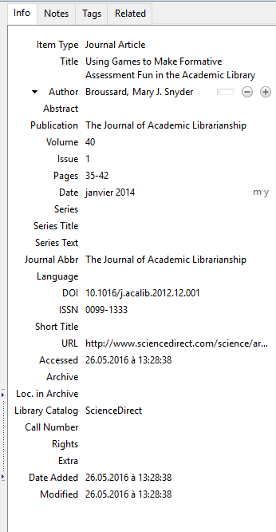
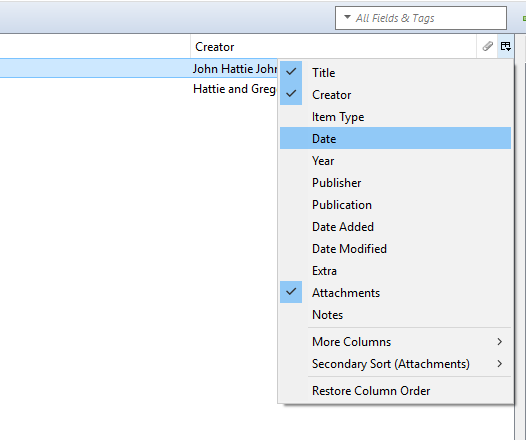
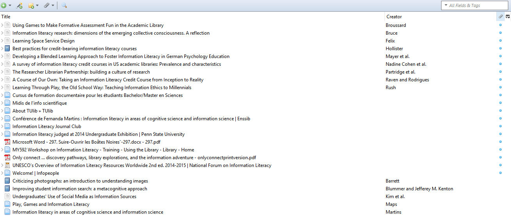

# Exercises
##Discover Zotero's functionalities  
Well done! You have installed Zotero on your computer. What do you find in your Zotero Library

As an iTunes Library, your Zotero Library is a list of items = your references.  

Items/references are added by clicking on the Zotero connector in your browser or by drag-and-dropping the references from the webpage to your library (URLs). You can also add references in Zotero by import or manually. 

###Exercice 1: Collect references in your Zotero library

Add 5 references in your Zotero library. Try adding references of various doctypes:  

1. book 
2. paper 
3. conference paper
4. wikimedia commons imag
5. thesis  

###Exercice 2 : Search a reference

Find at least two ways of searching a reference in your library.

Solution 1: Search by "All fields & Tags"

Solution 2: Advanced search: click on the magnifying glass / Edit - Search = CTRL + F

Try the advanced search. Save your search. 

The file created is a new collection. This file is active: as soon as you will add new references with the keyword, the new reference will be archived in the file.

##Manage your Zotero Library: Collections, subcollections

Your Zotero Library is organized in columns: first colum is usually the arborescence of your files / collections.   You can create as many files / collections and subcollections as you want. Each item / reference will appear two times: first occurence is in your Library, and second occurence is in the collection if you put it in one of your collections.  Items that are not filed are listed in the "Unfiled Items" file. 

###Exercice 1 : Create and manage your collections

Create a collection. Put some of your references in this new collection. Click on one of the references and delete it from the collection, but not from your Library. Which option should you select?

Solution: "Remove item from Collection" // "Move item to trash" 

###Exercice 2 : "Duplicate Items" collection 
What is this file  made for?

Solution: Use [Zotero Documentation](https://www.zotero.org/support/duplicate_detection).

Last tips: Zotero's interface can be easily personalized. You can:

1. modify the order of your items/ references lists clicking on the Order button.

2. order your list of items/ references distinguishing the items with files attached or without files attached 
(Files attached = PDF, notes, screenshot, etc. attached to each item by yourself or automatically when collecting the references on the web.)

## Check the metadata of your item: Record Fields Doctype
Now that you are familiar with your collections and the list of your items, let's have a look on the record of each of your item.

Where do you see the metadata of each of your reference?
Clicking on one of your references, you see that the third column is full of details like in the following example...

###Exercice 1: Modify the type of an item and some fields of a record

Depending on the metadata found on the webpage by Zotero, some modifications of a record in your Library can be necessary. Check the items you just collected. Is the item Type field always correct? If not, modify it.

Solution: To modify the type of your item, you just have to correct the field and to select the right type in the list proposed by Zotero. You see that depending on the type of item, fiels of the record change.

Which are the main fields for the reference of a journal article?

Solution: Have a look on our [Rational Bibliographic guide, p. 16-17](https://library.epfl.ch/files/content/sites/library3/files/Formations/guide-redaction-references-web.pdf). It depends on your citation style! And also on the journal where your paper comes from (issue? volume? serie?).  

But still more important fields are: Title/ Author/ Title of the journal/ Publishing Date/ volume + issue+ pagesWhat about DOI? Can be useful, but it is not considered as a essential metadata. Like the URL, it is "just" a link providing access to the publisher's record on internet. 

### Exercice 2: Keep track of your readings
Explore various possibilities of keeping track of your readings: Add a note on one item from your Library. 

Solution: Click on a item and consult its record. Click on the "Note" page of the record and write some notes. A new attached file is created. When searching it in your items list, "All Fields" search includes the keywords present in your notes :)

##Create a bibliography and cite in Word/libreoffice 

How do Zotero and the word processor interact? First, both Zotero and the word processor have to be turned on. Then, to be able to use the interactive features, you need to have a Zotero button in your word processor. Can you see it? If not, in Zotero: edit --> preferences --> citation --> word processor: reinstall if this is not done.

### Exercice 1: Create a bibliography without citing 
Generate a bibliography in your word processor by selecting at least 3 references from Zotero. There are at least 2 ways to do it.

Solution 1: drag & drop

Solution 2: right click on the folder --> Create Bibliography from Selected Items --> output method: copy in the clipboard --> paste in the word processor.

###Exercice 2:  

Insert 3 citations and then create a bibliography

1. Write a few lines about your area of expertise. 

1. In your text, cite at least 3 documents that are saved in Zotero. TIPS: use the Zotero button in your word processor +  you are free to select any citation style.   

1. Generate a bibliography

Solution: Zotero button --> add/edit citation --> select a style --> select a reference (3 times), then Zotero button --> add/edit bibliography

##Choose your citation    style

8952 styles are available for Zotero! 

###Exercice 1: Your supervisor/publisher requires that you use a citation style called Copernicus

Copernicus is not listed in the short list!How can you add it to the citation styles list in Zotero? 

Solution: Zotero button --> document preferences --> click on "manage styles",  [a Zotero pop-up appears]     click on "obtain more styles", select the style Copernicus in the list, click on "OK". Then, try again to add your citation and choose Copernicus in the list.

###Exercice 2: Your paper is finished but... 

... your supervisor changes his mind and would like you to cite and deliver a bibliography using the IEEE style. Arrrgghh!! What can you do?

Solution: in your word processor: Zotero button --> document preferences --> choose the IEEE citation style --> OK. You can refresh if it you cannot see the changes right away.

NB: It is possible to adapt any existing style or to create a new one (much more time-consuming, though) if your dream style does not exist yet.
